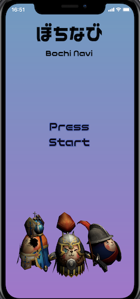
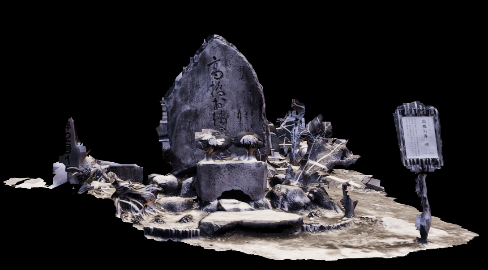

### ぼちなび

* 制作期間： 2021年2月~４月　約６０日間
* 使用技術： Unity,C#,immersal,Playfab,GoogleMapAPI
* Unityバージョン: 2019.4.17f1
* プロダクト紹介映像: https://youtu.be/iDfVqCxDq7I

### 概要
自分が一番情熱を持って取り組めたゲーム制作をテーマにAR位置情報ゲームを作成しました。谷中霊園の墓地をテーマに、霊園内の偉人の墓地の前でアプリからカメラをかざすと、偉人にちなんだキャラクターが出現。キャラクターをタップすると、墓地の偉人がどんな人物だったのか、コメント欄を通してわかります。
VPS（Visual Positioning Service）と呼ばれるAR技術を活用することで、現実の空間にバーチャルのキャラクターを表示させました。VPSに関する日本語のドキュメントが全くなく、英文の公式ドキュメントを中心に自作した事は貴重な糧になりました。

### 開発の苦労した点
苦労したポイントは大きく分けて以下の3点です。
* 位置情報ゲームを成立させるためのゲームデザイン
* 墓地の上に特定のキャラクターを表示させるロジック。（誤差1m範囲の経度、緯度情報の取得）
* ゲームの保守・運用性を意識したコーディング

#### 位置情報ゲームを成立させるための設計
３dマップサービスを利用する際、各社、従量課金制を採用しているケースが多いこと、全国マップ全体にイベントやキャラクター配置をするためには膨大な工数が発生することから、個人開発で実現可能な形にする工夫が必要でした。結果、ゲームのエリアを谷中霊園内に特定、地図は２dのGoogleMapでキャラクターが出現するお墓をピン立てすることで、ユーザーが谷中霊園内をキャラクターの表示ポイントに向かって散策する、というゲーム性に着地させました。

#### 墓地の上に特定のキャラクターを表示させるロジック。（誤差1m範囲の経度、緯度情報の取得）
「特定の墓地の前でカメラをかざした際にキャラクターを表示させる」という機能要件を満たす技術選定がポイントになりました。UnityのARとして有名なVuforiaを利用するためには、墓地はマーカーとして成立しなかったこと（灰色一色の場合が多い）、墓地をマーカーとするにはサイズが大きすぎる事が問題になったため、*「経度・緯度」*情報に*「墓地とその周辺の空間を認証点とする」*という観点からImmersalを利用しました。

##### 図1 Immersalにて3dデータを取り込み描画した映像

